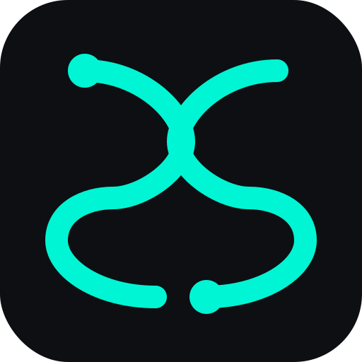

# Secular

> Digital freedom. Unblockable network access.

**Secular** is a cross-platform VPN client built for censorship resistance. It wraps all traffic in obfuscated HTTP/2 and QUIC streams that are indistinguishable from normal web traffic — powered by a Rust core with native clients on macOS, Windows, Linux, iOS, and Android.



- **§** — Brand identity: two interlocking S-shaped waves forming an S through negative space, with accent dots top and bottom
- **Supported platforms:** macOS (`.dmg`), Windows (`.msi`), Linux (`.AppImage`), iOS (App Store), Android (Play Store)
- **Design palette:** BG `#0D0F12`, Surface `#16191E`, Primary `#FFFFFF`, Secondary `#7A869A`, Accent `#0D0F12`, Alert `#FF3B30`

## Monorepo Structure

```
├── secular-core/        # Rust FFI library (protocol, crypto, DNS, MTU, uTLS)
│   ├── include/         # C headers for FFI
│   ├── uniffi-bindings/ # UniFFI scaffolding for Swift/Kotlin
│   └── src/
│       ├── protocol/    # Handshake, HTTP/2 + QUIC obfuscation
│       ├── dns/         # DNS leak prevention, port-53 hijacking
│       ├── mtu/         # Dynamic MTU clamping
│       ├── utls/        # uTLS randomized ClientHello fingerprinting
│       ├── network/     # Packet processing, TUN interface
│       ├── config/      # Configuration loader
│       └── ffi/         # UniFFI export macros
├── secular-desktop/     # Tauri v2 desktop app
│   ├── src-tauri/       # Rust backend + tray
│   └── src/             # React/TypeScript frontend
├── secular-android/     # Android (Kotlin VpnService)
├── secular-ios/         # iOS (Swift NetworkExtension)
├── assets/              # Logo & brand assets (SVG, PNG)
├── docs/                # Architecture, API, design specs
└── .github/workflows/   # CI/CD for DMG, MSI, AppImage
```

## Philosophy

Secular exists because access to information is a fundamental right. Not a privilege.

We wrap payloads in traffic that mimics standard HTTPS/QUIC — not to hide that you're using a VPN, but to make it *impossible to distinguish* from normal browsing. This is what makes it unblockable.

## License

See `LICENSE` file.
